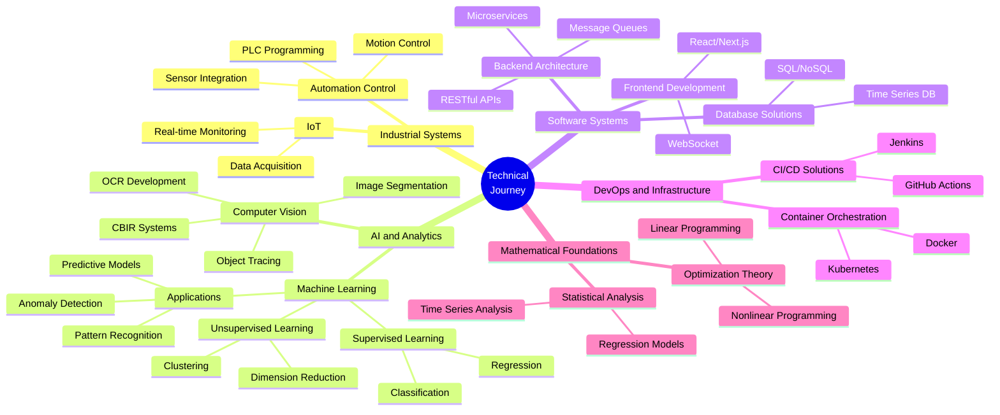

### `{ Owen }` 

> Hi, I'm Owen from Taiwan.  
>  
> After years of coding journey,  
> I made a bold decision to embrace a gap year,  
> starting from late 2024.  
>   
> Since then, I've adopted a more fluid way of working and thinking,
> focusing on building my own solutions,  
> and turning ideas into reality.  

### 💭 Philosophy

> In an era where everyone chases titles and wealth,  
> we're always busy planning for tomorrow,  
> missing the precious moments of today.  
>   
> True happiness isn't found in final achievements,  
> but in every surprise and growth along the way.  

### 🎯 Field I Experenced

 

📫 Connect me: gba3124@gmail.com

